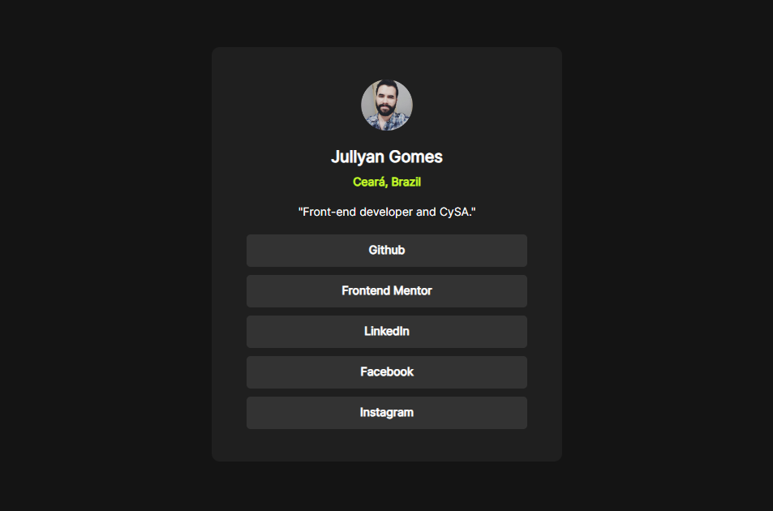

# Frontend Mentor - Social links profile solution

This is a solution to the [Social links profile challenge on Frontend Mentor](https://www.frontendmentor.io/challenges/social-links-profile-UG32l9m6dQ). Frontend Mentor challenges help you improve your coding skills by building realistic projects. 

## Table of contents

- [Overview](#overview)
  - [Screenshot](#screenshot)
  - [Links](#links)
- [My process](#my-process)
  - [Built with](#built-with)
  - [What I learned](#what-i-learned)
  - [Continued development](#continued-development)
  - [Useful resources](#useful-resources)
- [Author](#author)
- [Acknowledgments](#acknowledgments)


## Overview


### Screenshot




### Links

- Solution URL: [Add solution URL here](https://your-solution-url.com)
- Live Site URL: [Add live site URL here](https://your-live-site-url.com)

## My process

### Built with

- Semantic HTML5 markup
- CSS custom properties
- Flexbox


### What I learned

I used this simple project to remind me of some key CSS features, like proper flexbox, media queries and css rules. I also learned that we use `<a>` for creating buttons and not necessarily the `<button>` tag.


```css
.socialMedia__container {
    /* Layout do botão*/
    height: 40px;
    width: 80%;
    background-color: var(--grey);
    display: flex;
    justify-content: center;
    padding-top: 10px;
    margin-bottom: 10px;
    border-radius: 5px;
    border: none;
    cursor: pointer;
    /* Texto do botão */
    font-size: 14px;
    font-weight: 600;
    color: var(--white);
}
```
```html
<div class="socialMedia">
        <a href="https://github.com/jullyanvpr" class="socialMedia__container" target="_blank">Github</a>
```


### Continued development

I would like to continue learning more about CSS with new projects, practicing with CSS Grids, more media queries and using javascript to make it more interactive.


## Author

- Frontend Mentor - [@jullyanvpr](https://www.frontendmentor.io/profile/jullyanvpr)
